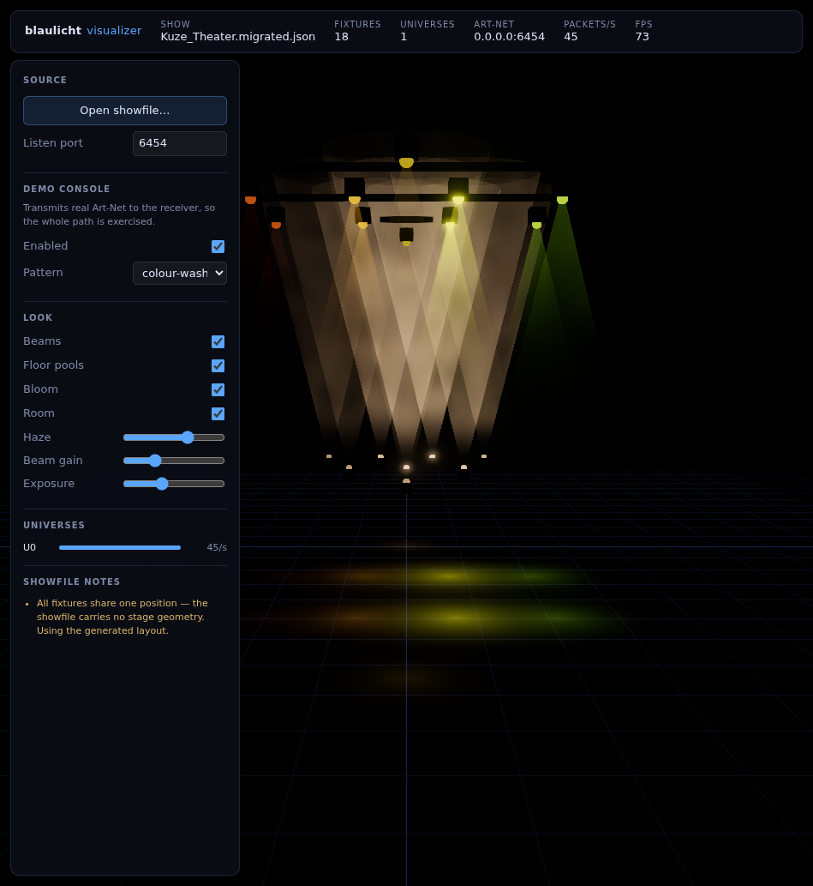

# blaulicht visualizer

Real-time 3D previsualisation for [blaulicht](../README.md) rigs. Load a blaulicht
showfile, point blaulicht's Art-Net output at this app, and watch the rig.



## What it does

- **Parses blaulicht showfiles** — groups, fixtures, patch, stage room and
  Art-Net receivers. Tolerant of format drift: `format_version` 3 and 4, files
  with no version and no `stage` section, and `BTreeMap`s serialised either as
  `[{key, value}]` arrays or as plain objects.
- **Decodes DMX exactly like blaulicht does.** All 21 fixture profiles
  (16 lights, 2 moving heads, 3 dimmers) are ported from
  `crates/shared/src/fixture/*.rs`, including the MAC 250 Entour colour wheel and
  every strobe range remap. The test suite pins this against golden vectors
  lifted from the Rust unit tests.
- **Receives Art-Net 4** — ArtDmx, ArtSync and ArtPoll, with sequence-number
  reordering, short-packet handling and per-universe traffic statistics.
- **Renders volumetrically** — instanced cone beams with animated haze,
  floor light pools, bloom, SMAA and ACES tone mapping. The whole rig is four
  draw calls, so a 500-fixture showfile still runs at 60 fps.
- **Validates the patch** — reports fixtures that overlap in a universe or run
  past channel 512, and tells you when a showfile has no stage geometry.
- **Ships a demo console** so it is useful with nothing else running.

## Running it

```sh
npm install
npm run build
npm start -- ../SPARTACUS_DRAFT.json     # or use the in-app file picker
```

`npm run dev` starts Vite with hot reload for the renderer.

Then point blaulicht at it — add a receiver on `127.0.0.1:6454` in the showfile's
`artnet.receivers`, or change the listen port in the sidebar.

No lighting desk to hand? Tick **Demo console**. It transmits real Art-Net
datagrams at the receiver rather than injecting DMX directly, so what you see
travelled the same path as live traffic.

### On NixOS

The prebuilt npm Electron binary cannot resolve its shared libraries, and this
repo's direnv shell exports an `LD_LIBRARY_PATH` that breaks the nixpkgs build
too. Use:

```sh
env -u LD_LIBRARY_PATH nix shell nixpkgs#electron --command electron . ../SPARTACUS_DRAFT.json
```

The test suite detects and handles this automatically.

## Stage geometry

Every showfile in this repo stores all fixtures at the origin — blaulicht's
engine never needed coordinates. When positions are degenerate the visualiser
says so in **Showfile notes** and generates a rig instead: one truss row per
group spread across the room depth, with trim height chosen per fixture (heads
high, washes at truss level, hazers and floor packs on the deck). Showfiles that
do carry real positions are used as-is.

## Testing

```sh
npm test          # 100 tests
npm run typecheck
```

The suite covers:

| File | What it pins |
| --- | --- |
| `tests/artnet.test.ts` | Packet layout, the 15-bit port address, every rejection path, sequence wrap |
| `tests/profiles.test.ts` | Channel footprints, golden vectors from the Rust tests, encode→decode for all 21 profiles, channel-range isolation |
| `tests/showfile.test.ts` | Parsing, format drift, patch validation — plus every real showfile in this repo |
| `tests/layout.test.ts` | Generated rigs, per-fixture trim, dense-row spacing, bounds |
| `tests/frame.test.ts` | The IPC binary framing, including alignment padding |
| `tests/dmxstore.test.ts` | Universe isolation, stale-packet rejection, rate measurement |
| `tests/pipeline.test.ts` | End-to-end over a **live UDP socket**: console → encode → Art-Net → receiver → decode |
| `tests/electron.test.ts` | Boots the real app, drives it with Art-Net, reads the framebuffer back and asserts the stage is lit — and dark on blackout |

## Architecture

```
src/core/      Pure TypeScript. No Node, no Electron, no Three.js.
               artnet · profiles · encode · showfile · layout · dmxstore
               frame · console · color · ipc
src/main/      Electron main: UDP socket, showfile IO, demo sender.
src/preload/   Context-isolated bridge. The renderer gets no Node access.
src/renderer/  Three.js stage, shaders and HUD.
```

DMX moves from main to renderer as one transferable `ArrayBuffer` per tick
(`src/core/frame.ts`) rather than as structured-cloned objects — at 44 Hz across
a dozen universes the difference is megabytes per second.

## Notes on fidelity

The decoders match `crates/shared` channel for channel, with two deliberate
exceptions, both because blaulicht's engine discards information a *visualiser*
needs:

- **`VaryTechVP1`** decodes to black in Rust — the engine only ever drives its
  dimmer. Rendering that literally made a blinder at full output invisible, so
  the visualiser derives white from the fixed warm/cold white channels.
- **`DimmerSingle` / `DimmerWStrobe`** carry no colour at all, so they are
  rendered as tungsten rather than as black.

Both are covered by tests in `tests/profiles.test.ts`.
